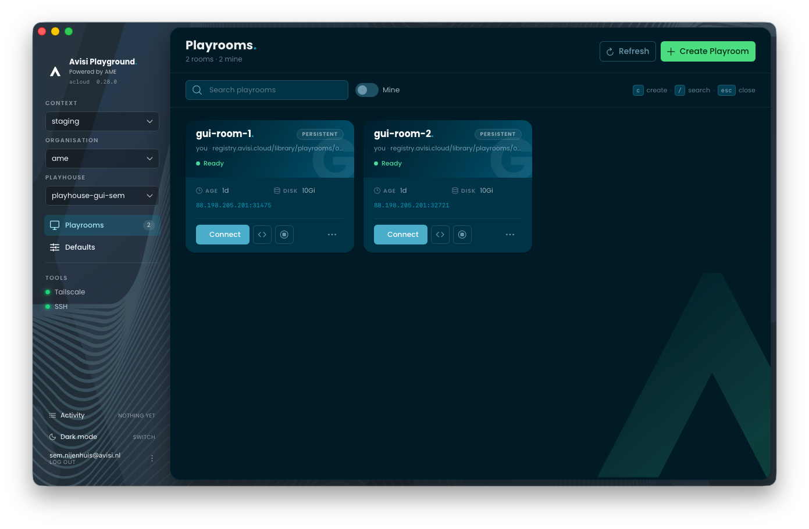
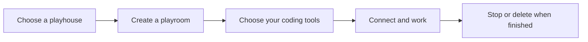
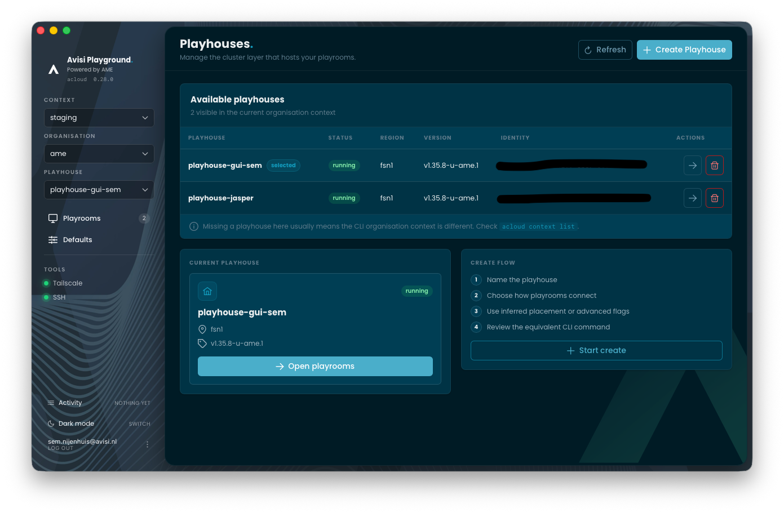
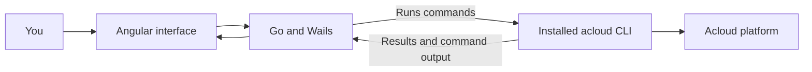

<div align="center">

# Acloud Playrooms

**Your Acloud development environments, in a Mac app.**

[](https://github.com/avisi-cloud/acloud-playrooms/actions/workflows/ci.yml)
[](https://github.com/avisi-cloud/acloud-playrooms/releases/latest)
[](LICENSE)


[Get started](#get-started) · [How it works](#how-it-works) · [Develop](#develop) · [Release](doc/RELEASING.md) · [Contribute](CONTRIBUTING.md)

</div>



## What is this?

Imagine having a separate computer for a coding task, already equipped with the
tools you need. It runs in the cloud, so you can connect to it from your Mac.
In Acloud, that workspace is called a **playroom**.

Acloud Playrooms is the app you use to create those workspaces, see which ones
are running, and connect to them. Choose a workspace image with tools such as
Codex, Claude Code or OpenCode, and manage it from one window.

| A word you will see | What it means                                        |
| ------------------- | ---------------------------------------------------- |
| **Playroom**        | Your cloud development workspace                     |
| **Playhouse**       | The environment that hosts a collection of playrooms |
| **Acloud CLI**      | The command-line program that does the actual work   |
| **This app**        | A visual interface that runs those commands for you  |

> [!IMPORTANT]
> You need an Acloud account with access to a playhouse and the `acloud` CLI.
> The app is open source; access to Acloud infrastructure is separate.

## From an idea to a workspace



- **Create** a workspace with an image, resources and configuration of your choice.
- **See** your playrooms and their current status in one place.
- **Connect** through your terminal, or open the tools the workspace exposes.
- **Manage** existing workspaces: start, stop, edit and delete.
- **Inspect** the command before a form runs it, and follow output in the activity log.
- **Switch** between Acloud contexts, organisations and playhouses.

<details>
<summary><strong>See the playhouse selection screen</strong></summary>



</details>

## Get started

### 1. Install and sign in to Acloud

On macOS with [Homebrew](https://brew.sh) installed:

```sh
brew tap avisi-cloud/tools
brew install --cask avisi-cloud/tools/acloud
acloud auth login
```

Already using Acloud? Check your existing installation with `acloud version`
and `acloud auth status`.

### 2. Install Acloud Playrooms

Once the first automated release has been published to the Homebrew tap:

```sh
brew install --cask avisi-cloud/tools/acloud-playrooms
```

Or download the universal macOS ZIP from [GitHub Releases](https://github.com/avisi-cloud/acloud-playrooms/releases),
unzip it, and move **Acloud Playrooms.app** into **Applications**.
The same download supports Apple Silicon and Intel Macs running macOS 12 or later.

> [!NOTE]
> Builds are currently ad-hoc signed, not Apple-notarized. The Homebrew cask
> removes the download quarantine flag for this app. Direct downloads may need
> approval in macOS Privacy & Security. [Details and signing plans](doc/RELEASING.md#macos-signing-and-quarantine).

### 3. Open the app

Open **Acloud Playrooms** from Applications, choose your playhouse, and create
or select a playroom. Connecting opens your selected terminal.

Update a Homebrew installation with:

```sh
brew upgrade --cask avisi-cloud/tools/acloud-playrooms
```

<details>
<summary><strong>Something is not working?</strong></summary>

| What you see                          | What to check                                                                                            |
| ------------------------------------- | -------------------------------------------------------------------------------------------------------- |
| The app cannot find Acloud            | Run `acloud version` in your terminal. Install the CLI if it is missing.                                 |
| You are not signed in                 | Run `acloud auth login`, then return to the app.                                                         |
| No playhouses appear                  | Check the selected context and organisation, and your access to them.                                    |
| A command fails                       | Open the activity log for the CLI's output and error details.                                            |
| A direct download is blocked by macOS | Check the release source, then follow [Apple's instructions](https://support.apple.com/en-us/102445).    |
| Homebrew cannot find the cask         | The first automated release may not have been published yet. Check GitHub Releases or build from source. |

For reproducible bugs, [open an issue](https://github.com/avisi-cloud/acloud-playrooms/issues)
with the app and CLI versions, what you expected, and what happened. Remove
credentials and private infrastructure details from logs and screenshots.

</details>

## How it works

The app builds the same command you could type yourself and runs your installed
`acloud` program. The CLI remains responsible for what happens on the platform.



This repository contains the public desktop application. It does not contain
the private CLI, cloud credentials or a second implementation of Acloud.
Building and testing it does not require the private CLI source.

<details>
<summary><strong>For developers: the command contract</strong></summary>

For example, the GUI can run:

```sh
acloud playhouse list -o json
acloud playroom create demo --playhouse playhouse-demo --image opencode
acloud playroom connect demo --playhouse playhouse-demo
```

Go serializes form values into arguments. The same arguments produce the
command preview, with sensitive values redacted. A subprocess runner captures
stdout and stderr, streams user-initiated operations, and supports cancellation.
Reads use JSON output where available. Interactive commands open a real terminal.

The app uses **Wails 3**, **Go**, **Angular**, and **PrimeNG**. macOS is the
supported desktop platform; terminal integration for other operating systems
is not implemented.

The private CLI can provide `acloud playhouse interface` as a launcher for the
installed application. The GUI remains a separate application and Go module.

Read [ARCHITECTURE.md](doc/ARCHITECTURE.md) for the rules behind this boundary.

</details>

## Develop

You need macOS, Xcode Command Line Tools, Go matching `go.mod`, and Node.js 24
(also recorded in `.nvmrc`). Wails is installed at the version used by the app.

```sh
git clone https://github.com/avisi-cloud/acloud-playrooms.git
cd acloud-playrooms
npm --prefix frontend ci
make dev
```

| Command                 | Result                                                                           |
| ----------------------- | -------------------------------------------------------------------------------- |
| `make dev`              | Start the app with live development                                              |
| `make dev-local`        | Use the CLI built at `../acloud/bin/acloud`                                      |
| `make build`            | Build the app for your Mac in `bin/`                                             |
| `make check`            | Check Go formatting, frontend formatting/lint/build/tests, Go vet and race tests |
| `make package`          | Build a universal Mac application                                                |
| `make release-snapshot` | Build and verify release files locally, without publishing                       |

Run `make build` before `make check` on a fresh checkout so generated bindings
are current. Go GUI tests embed the frontend build, which `make check` produces.

<details>
<summary><strong>Use a local or custom acloud binary</strong></summary>

Build the CLI in your sibling `acloud` checkout, then run:

```sh
make dev-local
```

For a different location:

```sh
make dev-local LOCAL_ACLOUD=/absolute/path/to/acloud
```

Or copy `.env.example` to `.env.local` and set `LOCAL_ACLOUD` there.
`.env.local` is ignored by Git. The application also accepts `ACLOUD_BINARY`:

```sh
ACLOUD_BINARY=/absolute/path/to/acloud make dev
```

Use an absolute path because macOS launches app bundles from a different
working directory.

</details>

## Releases and maintenance

Merge a fix or feature, then review and merge the release PR created by
**Release Please**. The pipeline builds a universal Mac app with Wails, packages
it with GoReleaser, verifies it, uploads it to GitHub Releases and updates Homebrew.
**Renovate** prepares dependency update PRs for review.

Maintainers: complete the [one-time GitHub setup](doc/RELEASING.md#one-time-github-setup)
before the first release. Contributors: use [Conventional Commit PR titles](CONTRIBUTING.md#pull-request-titles).

## Go deeper

| I want to...                         | Read                                |
| ------------------------------------ | ----------------------------------- |
| Make my first contribution           | [Contributing](CONTRIBUTING.md)     |
| Understand the architectural rules   | [Architecture](doc/ARCHITECTURE.md) |
| Find the command runner or Go code   | [Backend guide](doc/BACKEND.md)     |
| Work on a screen or frontend state   | [Frontend guide](doc/FRONTEND.md)   |
| Understand past choices              | [Decisions](doc/DECISIONS.md)       |
| Set up releases, Homebrew or signing | [Release guide](doc/RELEASING.md)   |

## License and ownership

Copyright 2026 Avisi Cloud. Licensed under [Apache-2.0](LICENSE).

You may use, modify and redistribute the code, including commercially, under
the license's terms. Copyright and required attribution notices remain in place.
Avisi and Acloud trademarks are not licensed for use as your own branding.
See [NOTICE](NOTICE) and [the license's trademark terms](https://www.apache.org/licenses/LICENSE-2.0#trademarks).

This license covers this repository. The separately installed Acloud CLI and
access to the Acloud service have their own terms.
