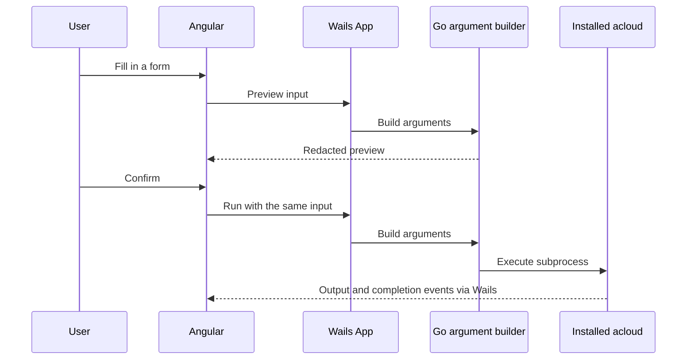

# Architecture

**The CLI owns platform behaviour. The GUI builds arguments and runs it.**

Acloud Playrooms is a standalone public desktop application. It runs the
separately installed `acloud` binary; it does not embed or import the private CLI.

## Request flow



Paths in this guide are relative to the repository root.

## The contract

A command implementation has three parts:

```go
type CreateInput struct { /* fields collected by the GUI */ }

func Create(ctx context.Context, operationID string, input CreateInput) error {
    _, err := cli.Run(ctx, buildCreateArguments(input), cli.Options{
        OperationID: operationID,
    })
    return err
}

func buildCreateArguments(input CreateInput) []string {
    return cli.NewCommandArguments("playroom", "create").
        Positional(input.Name).
        Str("--image", input.Image).
        Build()
}
```

The builder serializes input. It does not construct Kubernetes objects, contact
Acloud APIs, or duplicate the CLI's business logic.

Blank strings and unset optional fields are omitted so the CLI can apply its own
defaults. Definite switches such as `--read-only`, `--privileged` and
`--forward-agent` use explicit true/false values where configured CLI defaults
could otherwise override the user's choice.

## Running commands

`backend/cli` resolves the executable and caches it until something changes it:

1. An explicit test override, when supplied.
2. `ACLOUD_BINARY`, when configured.
3. The path the user set in the app, stored next to the remembered theme.
4. `acloud` on `PATH`.
5. The known install directories (both Homebrew prefixes, MacPorts, `~/.local/bin`,
   `~/bin`, `~/go/bin`).

Steps 3 and 5 exist because a bundle launched from Finder inherits
`/usr/bin:/bin:/usr/sbin:/sbin` and no Homebrew prefix, so `PATH` alone misses
an acloud that works in any terminal. Saving a path clears the cache, so the
change applies to the next command rather than the next launch.

It executes that binary with an argument array, not a shell command string.

Calls with an `OperationID` stream events to the activity log and can be
cancelled. Cancellation interrupts the process, allows a five-second cleanup
period, then kills it if necessary. Calls without an ID capture output without
streaming it, which keeps routine JSON reads out of the activity log.

The activity log stays closed during ordinary work and opens on failure. Both
stdout and stderr are captured so failures include the CLI's explanation.

### Interactive commands

`playroom connect` and `auth login` are handed to a real terminal through
`backend/terminal`. Terminal.app, iTerm and Ghostty are supported on macOS.
Other operating systems do not have a working terminal hand-off yet.

Commands such as `config use-context` and `config use-organisation` accept a
selected value directly, so the GUI supplies it instead of opening an fzf picker.

## Ownership boundaries

| Area                                      | Responsibility                                                   |
| ----------------------------------------- | ---------------------------------------------------------------- |
| `frontend/src/app/`                       | Screens, forms, UI state and activity log                        |
| `frontend/bindings/`                      | Generated Wails bridge; never hand-edited                        |
| `app*.go`, `events.go`, `run.go`          | Thin native application facade                                   |
| `backend/cli/`                            | Subprocess execution, output, errors, redaction and cancellation |
| `backend/playroom/`, `backend/playhouse/` | Inputs, argument builders and JSON decoding                      |
| `backend/config/`, `backend/auth/`        | Configuration commands and authentication hand-off               |
| `backend/terminal/`                       | Interactive command launch                                       |
| `backend/local/`                          | Small local reads and GUI preferences                            |
| `build/`                                  | Wails build and packaging tasks                                  |

Backend packages do not import Wails. An injected emitter connects the runner
to the UI, so command tests can run without a window. Wails-facing Go files use
the `gui` build tag.

No production code or public CI test may import the private `acloud` module.

## Local reads and preferences

All platform mutations and listings go through real CLI commands. The GUI does
not make its own Acloud or Kubernetes API requests.

The limited exceptions live in `backend/local`:

- Reading the CLI's local configuration for the cached playhouse and user.
- Checking whether cached credentials exist, without treating that as server validation.
- Listing a small, maintained image catalog as a picker convenience.
- Probing local tools and comparing the installed CLI version with the version
  the screens were last verified against.
- Remembering the app theme in a GUI-specific file.

Configuration is read again on each lookup so a login or context change made by
a subprocess becomes visible. The GUI does not write the CLI configuration
directly. The remembered theme is separate from `~/.acloud.yaml`.

The former embedded prototype discussed direct status reads through private
CLI packages. That implementation is not available in this standalone app.
Any future shortcut must preserve the public/private boundary.

## Command previews and credentials

Preview functions use the same Go argument builders as execution. The frontend
never reconstructs a command from its own rules.

Previews, displayed errors and activity output redact sensitive values. Flags
containing `secret`, `token`, `password` or `passwd` are treated as sensitive.
The real command still receives the actual input.

Terminal commands are quoted before being handed to a shell. Normal runner
calls pass arguments directly to `exec.CommandContext`.

## Add a command or flag

1. Add or extend the Go input and argument builder.
2. Expose the operation through `App` if it is new.
3. Add argument tests and a preview function if the UI needs a preview.
4. Run `make build` to regenerate bindings.
5. Add the UI control and a way to reach it.
6. Account for the field in `input-coverage.spec.ts`.
7. Run `make check` and commit generated binding changes.
8. Verify the command against the supported CLI.

## Coverage and its limits

Go argument tests check command serialization. Runner tests use fake programs
to check output, errors, redaction and cancellation. Frontend input coverage
requires fields to be accounted for as wired or deliberately omitted.

This public repository does **not** walk the private CLI's Cobra tree. The
old parity helpers remain in `backend/cli/clitest`, but no current parity tests
import the private CLI. Compatibility with a newly released CLI still needs
verification. Update `VerifiedAgainstAcloudVersion` when that verification is done.

No unit test can establish that a screen is reachable or pleasant to use.
Check the complete path from opening a screen through completing the action.

GitHub runs the available checks and a universal macOS packaging rehearsal.
See [Releasing](RELEASING.md) for the automation and [Backend](BACKEND.md) for
the implementation details.
