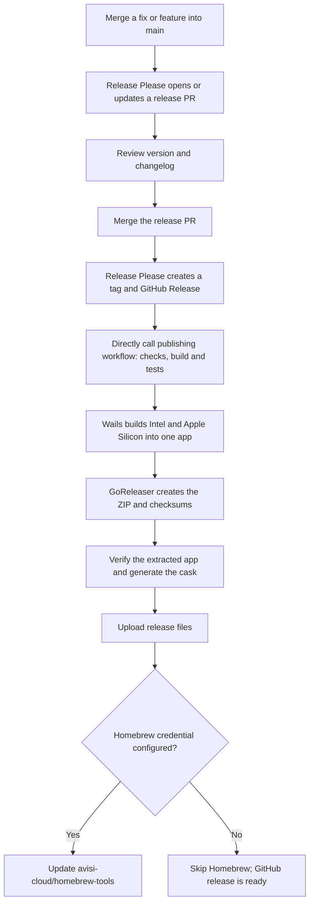

# Releases and repository setup

The normal release is **merge changes, review the generated release PR, merge it**.
GitHub builds the application and attaches the download. It also updates Homebrew
when the optional Homebrew credential is configured.
No developer needs to build or upload the production app by hand.



## One-time GitHub setup

1. Enable GitHub Actions and use `main` as the default branch. Enable squash
   merging and use the pull request title as the squash commit title.
2. Install or enable the [Renovate GitHub app](https://github.com/apps/renovate)
   for this repository. `renovate.json` controls dependency update PRs; merely
   committing the file does not activate the app.
3. Enable **Allow GitHub Actions to create and approve pull requests** under
   **Settings > Actions > General**. An organisation admin may need to allow this.
4. Require the `Conventional Commit title`, `Frontend checks` and `macOS checks and release rehearsal` checks
   in the branch rules for `main`.
5. Optionally configure the Homebrew secret below in
   **Settings > Secrets and variables > Actions**. This can be done later.

| Secret                        | Repository access            | Fine-grained token permissions |
| ----------------------------- | ---------------------------- | ------------------------------ |
| `HOMEBREW_TOOLS_GITHUB_TOKEN` | `avisi-cloud/homebrew-tools` | Contents: read/write           |

Use an organisation-approved automation account for the Homebrew token. The
secret has the same name as in `acloud-toolkit`. Organisation policies may require
approval of the tokens or permission for the automation account to push to the tap.

Release Please and release uploads use GitHub's automatically provided
`GITHUB_TOKEN`. No `RELEASE_PLEASE_TOKEN` or personal release token is needed.
When Release Please creates a release, its dependent job calls the reusable
publishing workflow directly with the new tag. This does not rely on the tag
starting another workflow, which GitHub suppresses for built-in-token pushes.

On a generated release PR, use **Approve workflows to run** if GitHub requests
approval, then wait for the required checks before merging. See
[GitHub's workflow-trigger rules](https://docs.github.com/en/actions/how-tos/write-workflows/choose-when-workflows-run/trigger-a-workflow).

The publishing job uses the built-in `GITHUB_TOKEN` for release uploads and the
separate Homebrew token only when checking out and updating the tap. Without it,
the ZIP, checksums and generated cask are still published to GitHub; the workflow
summary notes that the tap update was skipped. Add the secret later to enable
tap updates for subsequent releases. A configured but invalid token still fails
the Homebrew step so credential problems are not silently ignored.

## What each tool does

| Tool                         | Responsibility                                                                   |
| ---------------------------- | -------------------------------------------------------------------------------- |
| Release Please               | Version proposal, changelog, release tag and GitHub Release                      |
| Wails                        | Bindings, frontend build, native Go build, universal binary and `.app` packaging |
| GoReleaser v2 OSS            | Release archive, SHA-256 checksums and build metadata                            |
| `generate-homebrew-cask.mjs` | An app cask using the archive's actual SHA-256                                   |
| GitHub Actions               | Checks, artifact verification, upload and Homebrew update                        |
| Renovate                     | Dependency update PRs; no automatic merging                                      |

Wails already supplies `darwin:package:universal`, so we reuse it through
`make package`. GoReleaser's build stage is skipped because Wails has already
compiled the application. GoReleaser OSS's standard cask generator targets
binaries; its dedicated `app` support requires Pro. A small local generator
produces the Homebrew `app` stanza without a paid dependency. See the
[GoReleaser cask documentation](https://goreleaser.com/customization/homebrew_casks/).

## Versioning

The initial baseline is `0.28.0`, matching `build/config.yml`.
Release Please updates both its manifest and `build/config.yml` in each release
PR. The `x-release-please-version` marker preserves the Wails configuration's
comments and formatting. Release Please also creates or updates `CHANGELOG.md`;
this generated file is intentionally excluded from Prettier checks.

Release builds use the tag-derived version for both bundle version fields before
signing. Local `make package` uses the version in `build/config.yml` by default.
The sidebar's acloud version describes the separately installed CLI, not the GUI.

Use [Conventional Commit titles](../CONTRIBUTING.md#pull-request-titles). During
the `0.x` phase, fixes and features increment the patch; breaking changes
increment the minor. Stable releases use tags such as `v0.28.1`; this pipeline
does not publish prereleases to the shared Homebrew cask.

## Try a release locally

On macOS with Go, Node.js, Xcode Command Line Tools and GoReleaser v2 installed:

```sh
make release-snapshot
```

This produces a universal `.app` inside a ZIP, checksums, and a generated cask
under `dist/`. It extracts the archive, checks its checksum, bundle metadata,
both CPU architectures, ad-hoc signature, and cask syntax. Nothing is published.
Snapshot casks are for inspection; their download URLs are not published releases.

GitHub runs the same rehearsal for pull requests. It also verifies generated
bindings are committed, runs Go vet and race tests, and runs the frontend's
formatter, linter, production build and tests.

## Retry a release

Open **Actions > Publish release > Run workflow** and enter an existing stable
tag, for example `v0.28.1`. The job checks out that tag, repeats validation, and
replaces its release assets. It updates the Homebrew cask only when its content
changes and the Homebrew credential is configured. The GitHub Release must already
exist; Release Please creates it. This also lets you publish an existing release
to Homebrew after adding the credential.

A release becomes visible before the build completes, so a new release may
briefly have no downloads. If packaging or upload fails, retry that tag after
resolving the cause. If the source itself needs a fix, merge the fix and make a
new release instead of moving the old tag.

## macOS signing and quarantine

The current app is **ad-hoc signed**, not signed with an Apple Developer ID and
not notarized by Apple. The same distinction applies whether the code is public
or private: publishing source does not establish a trusted macOS signature.

The cask's `postflight` runs `xattr -dr com.apple.quarantine` only on the installed
`Acloud Playrooms.app`. This adapts the workaround used by `acloud-toolkit` to
an application bundle. It removes the download quarantine marker for Homebrew
installs; it does not make the app Apple-approved, and other device policies may
still block it. Nothing disables Gatekeeper globally.

A direct browser download does not run that cask hook. Users can follow Apple's
[instructions for opening an app from an unidentified developer](https://support.apple.com/en-us/102445)
after checking the source of the download.

For trusted distribution without this workaround, the next step is an Apple
Developer ID certificate and notarization credentials. Wails already includes
`darwin:sign` and `darwin:sign:notarize` tasks in `build/darwin/Taskfile.yml`.
CI would need to import the certificate into a temporary keychain, sign the
universal bundle, notarize and staple it before archiving, then remove the cask's
quarantine hook. These credentials are not required by the current workflow.
